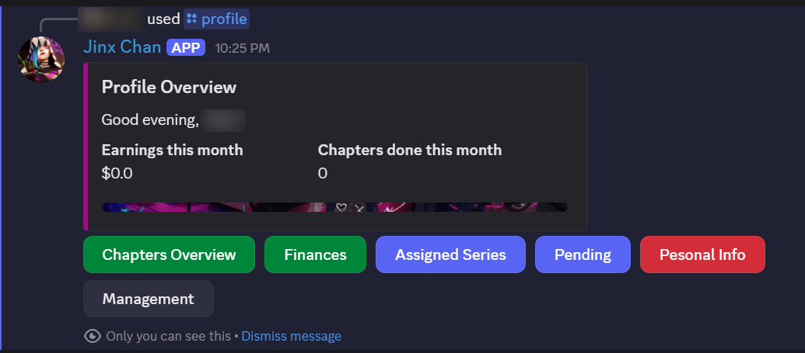
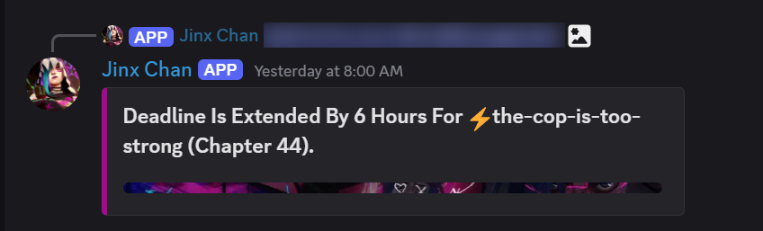
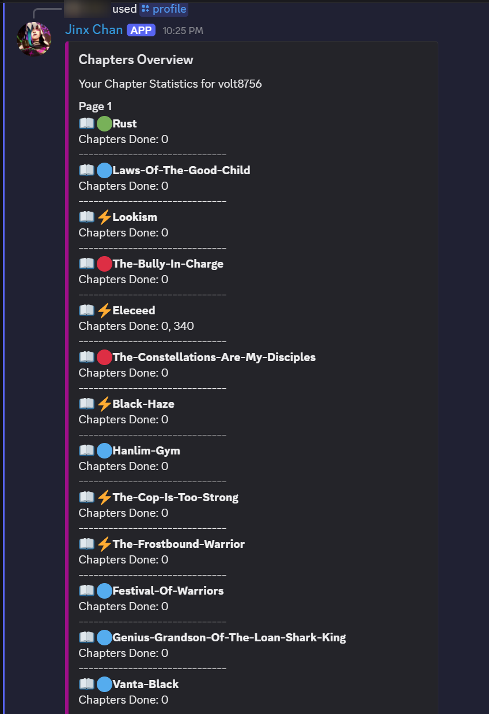
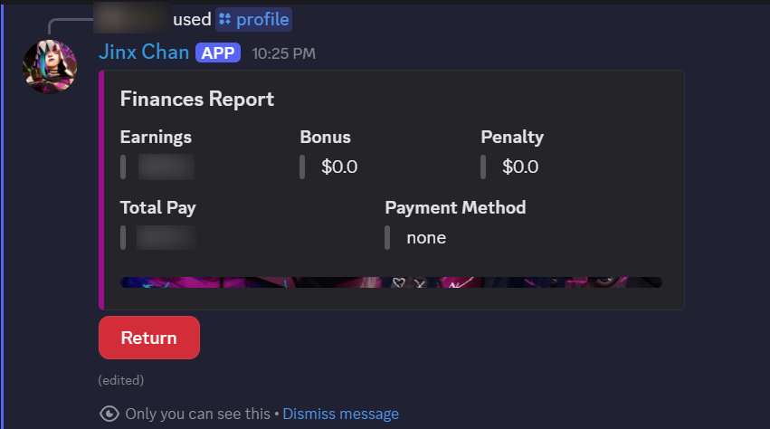
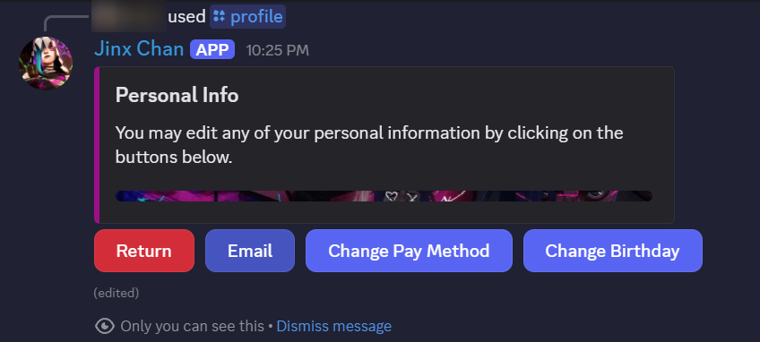
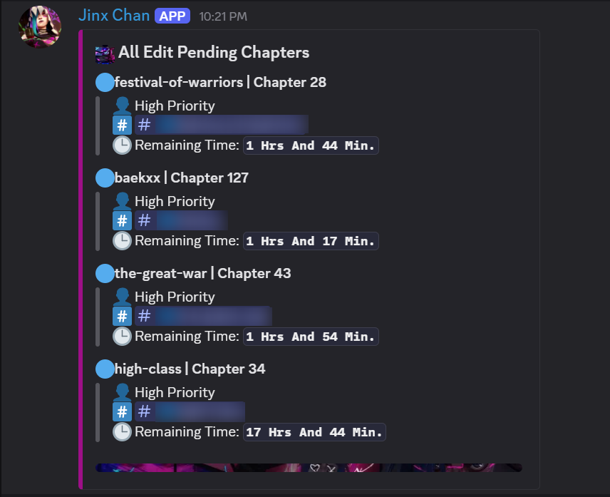
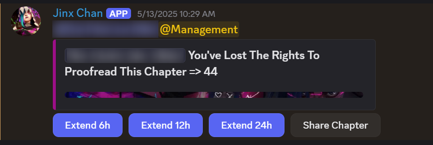

# Manga Workflow Manager Bot

## About The Project

The Manga Workflow Manager Bot is a powerful Discord bot designed to streamline and automate the entire workflow of a manga translation/editing server. It acts as a central management system, helping teams track chapters, assign tasks, manage deadlines, and handle user payments and statistics, all within Discord.

This bot aims to reduce manual overhead, improve efficiency, and provide transparency for all team members involved in bringing manga to readers.

### Features

* **Chapter Management:**
    * Add new chapters to a series.
    * Track the status of chapters through different stages (Raw Providing, Translation, Proofreading, Editing, Uploading).
    * Mark chapters as "done" for each stage.
    * Delete chapters from the system.
      
* **Role-Based Task Assignment:**
    * Assign specific translators, proofreaders, and editors to manga series.
      
* **Deadline Tracking & Notifications:**
    * Set and monitor deadlines for translation, proofreading, and editing stages.
    * Automatically notify staff and management when deadlines are approaching or have passed.
    * Ability for management to extend deadlines or share chapters for re-assignment.
      
* **User Profile & Statistics:**
    * `/profile` command to view personal earnings, chapters completed, pending tasks, and assigned series.
    * Manage personal information like email, payment methods (TRC 20, Binance ID, PayPal, etc.), and birthday.
      
* **Management Panel:**
    * View comprehensive team statistics, including earnings, payment methods, and links.
    * Export member statistics to CSV files.
    * Add bonuses or penalties to members' earnings.
    * Reset monthly statistics for all members, with archiving of old data.
    * Shift chapters between members for different roles.
      
* **Automated Updates:**
    * Regularly updates pending chapter messages in dedicated channels for each stage (TL, PR, ED, RP, Upload).
    * Monitors release schedules for new chapters and notifies relevant roles.
      
* **Robust Database Integration:** Uses `aiosqlite` for efficient and reliable data storage.
* **User-Friendly Interface:** Utilizes Discord slash commands, buttons, and modals for an intuitive user experience.

---

## Usage

The bot primarily uses Discord Slash Commands (`/`). You can find a list of commands by typing `/` in your Discord server and selecting the bot.

### General Commands

  

* `/profile`: View your personal statistics, earnings, and assigned chapters. This command opens an interactive menu with buttons for different profile sections.

---

### Management Commands

**(Requires "Management" role)**

* `/add_series <day> <time> <channel> <role> <site> <raw_link> <drive_link> <rp_money> <tl_money> <pr_money> <ed_money>`: Adds a new manga series to the system.
    * `day`: Release day (e.g., "Monday")
    * `time`: Release time (e.g., "01:00 PM")
    * `channel`: The Discord channel for the series.
    * `role`: The Discord role associated with the series (e.g., `@Manga Title`).
    * `site`: Source website (e.g., "Naver", "Kakao", "Others").
    * `raw_link`: Link to the raw chapters.
    * `drive_link`: Link to the shared drive for the series.
    * `rp_money`, `tl_money`, `pr_money`, `ed_money`: Payment rates for Raw Provider, Translator, Proofreader, and Editor per chapter.
      
* `/delete_series <role>`: Deletes a series from the system.
* `/delete_chapter <chapter_number>`: Deletes a specific chapter from the system.
* `/update_series <role> [day] [time] [channel] [site] [enabled] [raw_link] [drive_link] [rp_money] [tl_money] [pr_money] [ed_money]`: Updates details of an existing series.
* `/series_list`: Lists all series currently tracked by the bot.
* `/add_chapter <chapter_number>`: Adds a new chapter for the current series (used in the series' specific channel). The bot will automatically notify the Raw Provider role.

---

  

* `/rp <chapter_number>`: (Raw Provider) Marks a chapter's raw provision as complete. Notifies the assigned translator.
* `/tldone <chapter_number>`: (Translator) Marks a chapter's translation as complete. Notifies the assigned proofreader.
* `/prdone <chapter_number>`: (Proofreader) Marks a chapter's proofreading as complete. Notifies the assigned editor.
* `/eddone <chapter_number>`: (Editor) Marks a chapter's editing as complete. Notifies the uploader role.
* `/udone <chapter_number>`: (Uploader) Marks a chapter's upload as complete.

---

  

* `/assign_tl <translator_name>`: Assigns a translator to the current series.
* `/assign_pr <proofreader_name>`: Assigns a proofreader to the current series.
* `/assign_ed <editor_name>`: Assigns an editor to the current series.
---
    

  

* `/reschedule_deadline <role> <chapter_number> <extended_hours>`: Force extends the deadline for a specific chapter and role.
  
---  
* `/add_bonus <member_name> <amount>`: Adds a monetary bonus to a member.
* `/add_penalty <member_name> <amount>`: Applies a monetary penalty to a member.
* `/shift_chapter <role> <original_holder> <new_holder> <chapter_number>`: Transfers responsibility for a chapter from one member to another.
* `/add_member <role> <member_name>`: Adds a new member to the bot's system for a specific role (e.g., `translator`, `editors`).
* `/series_info`: Shows detailed information about the current series in the channel.

---

### Profile Management (`/profile`)

  

* **`Chapters Overview`**: Shows a list of all chapters you've completed for each series.
---

  

* **`Finances`**: Displays your total earnings, bonuses, penalties, and preferred payment method.
---

  

* **`Personal Info`**: Allows you to update your email, payment method and link, and birthday.
---

* **`Assigned Series`**: Shows the manga series you are currently assigned to, along with their release schedules.
* **`Pending`**: Lists chapters waiting for your action.
  
---

## Automated Tasks

The bot runs several background tasks to keep the workflow smooth:

  

* **`check_series_updates`**: Runs every minute to check for new series releases based on their configured day and time. If a new chapter is due, it announces it in the series channel and adds it to the system.
  
---

  

* **`update_pending_message`**: Periodically updates the pending chapter messages in dedicated channels (e.g., `#pending-translation`, `#pending-proofreading`, `#pending-editing`, `#pending-upload`) to reflect the current status and remaining time until deadlines.
* **`update_pending_rp`**: Similar to `update_pending_message`, but specifically for pending Raw Provider chapters.
---

  

* **`check_deadline_time`**: Monitors chapter deadlines for translation, proofreading, and editing. If a deadline passes, it notifies management and the assigned member, offering options to extend the deadline or share the chapter for re-assignment to another team member.
---
## Contact

Discord: punchsamurai
Project Link: [https://github.com/your-username/your-repo-name](https://github.com/BlueEye2077/discord-manhua-bot)
